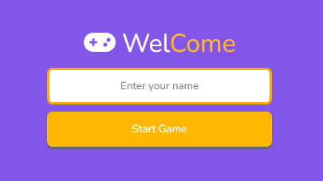
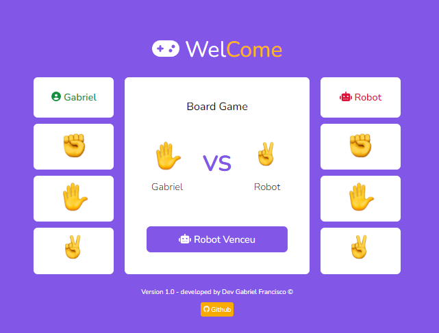
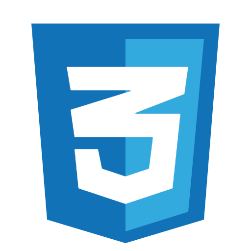

<<<<<<< HEAD
=======
# Game-Rock-Paper-Scissors
Trainning Javascript - Developer 🚧 - A Game 
>>>>>>> a3672709c6c104c9b17d20094fe4be740c62a7eb

# Game Logic Rules

1. STONE TAKES OVER SCISSORS; 
2. PAPER WIN FROM STONE; 
3. SCISSORS BEAT PAPER. 
4. EACH PLAYER SHOWS, 
5. AT THE SAME TIME, 
6. THE OPTION CHOSEN WITH HIS HAND.
<<<<<<< HEAD

# Game Layout

1. First Page (User Can put his name) 

2. Second Page(Board Game) 

# Tecnologies 

  

    

    
Html

  

  

    

    
Css

  

  

    

    
JavaScript

  

  

# Some Notes

This project is open source you can download and you can take to your workspace to show the code. andif you have some suggestion send email to: <a href="email:gabrielcorto272@gmail.com" target="_blank">gabrielcorto272@gmail.com</a>

=======
>>>>>>> a3672709c6c104c9b17d20094fe4be740c62a7eb
